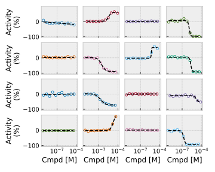
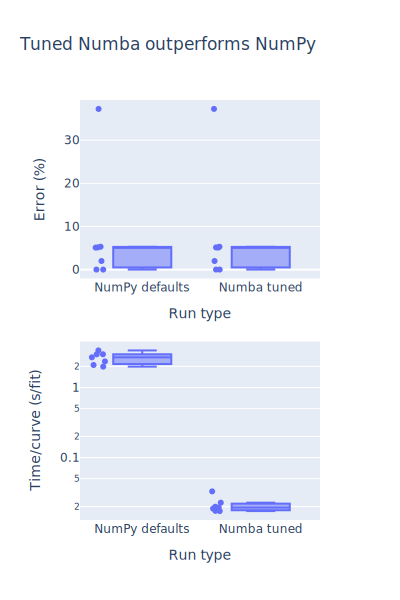
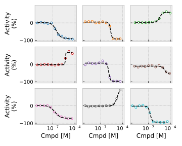

# dghf
`dghf` (damn good Hill fit) is a repository for fitting the [Hill equation](https://en.wikipedia.org/wiki/Hill_equation_(biochemistry)) to dose response curves. `dghf` is

- **Robust**, fitting the >17,000 dose response curves of the [CANVASS data set](https://pubmed.ncbi.nlm.nih.gov/30648156/) with median residual of less than 1.5% (examples below)

- **Fast**, using  with comparable error but ~10x faster versus vanilla NumPy:

- **Easy-to-use**, with both command line (cli) and python api and capability for multiprocessing
- **Customizable**, with the ability to easy constrain curves (or leave them unconstrained, the default)


# Installation

    conda env create --force --yes -f env.yaml

# Testing

    conda activate dghf
    python test.py

# Usage


## Python examples

The main fitting function is `dghf.fit`, which only requires an `x` and `y` variable.
It returns a dictionary with keys of the four parameters: `min_v,max_v,log_K_a,n`.
Note that the repository uses the natural logarithm of the binding constant (`log_K_a`) throughout:

### Example 1: Fitting and plotting y versus x data

```
from scripts import canvass_download
import dghf
x_y = canvass_download.demo_x_y_data()
all_fit_kw = [dghf.fit(x,y) for x,y in x_y]
dghf.gallery_plot(x_y=x_y,all_fit_kw=all_fit_kw).show()
```

Which should yield



### Example 2: Fitting and plotting y versus x data, using inactive range

For many data sets, there is an inactive range, and using it improves fit reliability. It is easy to specfify this range via the `inactive_range` parameter

```
from scripts import canvass_download
import dghf
x_y_examples = canvass_download.demo_x_y_data(cid_assay=canvass_download.active_and_inactive_cids())
all_fit_kw_examples = [dghf.fit(x,y,inactive_range=[-50,50]) for x,y in x_y_examples]
dghf.gallery_plot(x_y=x_y_examples,all_fit_kw=all_fit_kw_examples).show()
```

This should yield a plot like the following:


You can also specify bounds on the four parameters like so (e.g., for Hill coefficient `n` using `bounds_n`)

```
from scripts import canvass_download
import dghf
x_y_examples = canvass_download.demo_x_y_data(cid_assay=canvass_download.active_and_inactive_cids())
all_fit_kw_examples = [dghf.fit(x,y,bounds_n=[0,np.inf],inactive_range=[-50,50]) for x,y in x_y_examples]
dghf.gallery_plot(x_y=x_y_examples,all_fit_kw=all_fit_kw_examples).show()
```

## Command line examples

The command line is used to fit a set of data given in a flat file. This section is divided into two parts:

    1. Downloading exmaple data
    2. Fitting that example data

### Downloading CANVASS data

The entire [CANVASS data set](https://pubmed.ncbi.nlm.nih.gov/30648156/) can be downloaded using the following command (~17K curves, ~180K points):

```
conda activate dghf
python dghf.py export-canvass --output_file "canvas.csv"
head -n 2 canvas.csv
```

Which yields

```
Assay,Curve ID,PUBCHEM_ACTIVITY_URL,PUBCHEM_SID,PUBCHEM_RESULT_TAG,PUBCHEM_CID,PUBCHEM_ACTIVITY_OUTCOME,Curve_Description,Fit_LogAC50,Fit_HillSlope,Fit_R2,Activity (%),Concentration (M)
1347345,http://assay.nih.gov/htsws/rest/display/canvass-cancer-tox-panel-OV-KATE-72hr/NCGC00014994-10/222192710___376241717.0___229___1150.0___1347345,http://assay.nih.gov/htsws/rest/display/canvass-cancer-tox-panel-OV-KATE-72hr/NCGC00014994-10/222192710,376241717.0,229,1150.0,Inactive,,,,,1.1627,6.4267e-10
```

Note that this will cache the results in a local directory given by the optional `out_dir` parameter:

```commandline
python dghf.py export-canvass --out_dir cache --output_file "canvas.csv"
```

A subset (useful for small tests) can also be returned by the `random_sample` parameter:

```commandline
python dghf.py export-canvass --output_file "canvas.csv" --random_sample 5
```

### Fitting CANVASS data

The main function for fitting data is `fit-file` which is used as follows:

```
python dghf.py export-canvass --output_file "canvas.csv" --random_sample 5
python dghf.py fit-file --input_file "canvas.csv" --output_file "fit.csv"
```

The `fit-file` function has a number of parameters as given below:

```
Usage: dghf.py fit-file [OPTIONS]

  :param kw: see  _fit_file_helper :return: see _fit_file_helper

Options:
  --input_file FILE               Name of input file (must be csv)  [required]
  --output_file FILE              Name of output file (json, csv supported)
  --col_x TEXT                    x column (e.g., concentation)
  --col_y TEXT                    y column (e.g., activity)
  --col_id TEXT                   id column (e.g., concentation)
  --coarse_n INTEGER              Number of coarse grid points
  --fine_n INTEGER                Number of fine grid points for potency
  --bounds_min_v FLOAT...         Bounds for minimum fit value
  --bounds_max_v FLOAT...         Bounds for maximum fit value
  --bounds_log_K_a FLOAT...       Bounds for natural logarithm of Ka
  --bounds_n FLOAT...             Bounds for hill coefficient
  --inactive_range FLOAT...       Bounds for hill coefficient
  --method TEXT                   Bounds for hill coefficient
  --finish Choice([fmin_powell, fmin, fmin_cg, fmin_bfgs])
                                  Function for coarse grid finishing
  --n_jobs INTEGER                Number of cores to use; defaults to 1
  --help                          Show this message and exit.
```


# Future work

- Add support for analytically derived Hessian using WolframAlpha
- Support for downloading pubchem aids given paper title (might need to go paper -> compounds -> aids?)
- Demonstrate effect of dose response step size (e.g., 2x vs 3x vs 5x) on recovery of parameters
